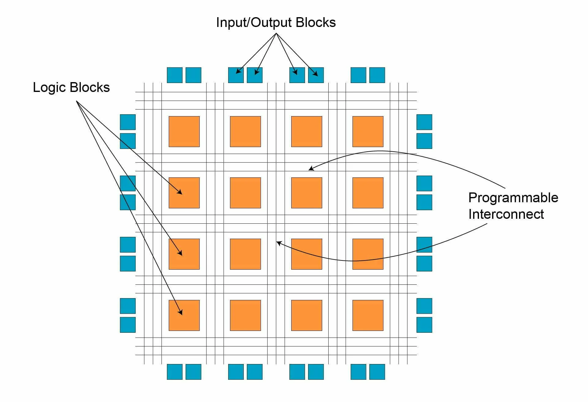

+++
title = "Hello world"
date = "2024-02-22T20:10:43-03:00"
author = "Belga, João P"

#
# A brief analysis of current chip context
#
# description = "An optional description for SEO. If not provided, an automatically created summary will be used."

tags = []
+++

Past week we all could see how chip industry is the 'real' hotspot of the moment. Sam Altman, with that statement, not only proved that our computational capacity is not enough for nowadays use with AI and complex algorithms, also showed that our projections of enhancing chips processing capacity, are, being optimistic, decreasing rapidly, for not saying that completely stagnated.  

  

Moore`s law is deprecated for now. 

  

So, the question that stands out is: how are we going to keep on tracks and continues supporting our crescent needs? 

 

Sam Altman, in the same speech, answers us. The rapidly and simple answer is accelerating! To understand how accelerators are going to provide the new breakthrough of computational needs is essential to understand how we managed to nowadays, enhancing our processing capacity without giving to much attention to then.  

  

Since the creation of CMOS transistors, the technology involved in chips is, basically, the same. Obviously, we had advancements in some algorithms, but the heart of the processors is the same: CMOS transistors, arranged in diverse ways to operate logical and arithmetic jobs. We have been enhancing the processing capacity by reducing the size of transistors. In an uncomplicated way, if we reduce the size of transistor by half, with the same circuit area we double the quantity, and, consequently, doubles the processing capacity. But physically we are reaching the boundaries. 

  

Accelerators then come to, not reduce the size of transistors, but implementing specific purpose processors that cannot work alone, but with a host that is responsible for manage the jobs, can execute then. Most used one is, clearly GPUs. But they are expensive in material price and in energy consumption. GPUs are great in processing graphic units, but this is not specific enough, we need to keep the demands constrain.  

 

And this is the problem we are working on solving.  

 

Working with stiff boundaries and requisites limits the solutions. But this does not signify a problem. Restricted solutions are, usually, more efficient, since processors do not need to be general purposed, less area and logic elements are used, meaning less energy needed. But we cannot popularise ASICs, they still expensive.  

 

Here comes the softcores! These are the first steps, the Hello World, from Balleb. 